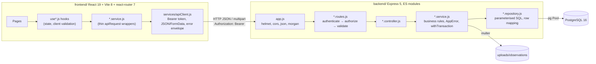

# 2. Architecture

## System shape

Two independent npm packages and a database. No monorepo tooling, no shared code between packages (role constants and validation limits are duplicated by hand on each side).



## Backend

### Boot sequence

`src/server.js` → `verifyDatabaseConnection()` (a `SELECT NOW()`) → `app.listen(PORT, "0.0.0.0")`. Any failure logs and `process.exit(1)`. `SIGTERM`/`SIGINT` close the HTTP server then drain the pool. `config/environment.js` runs at import time and throws on missing required env vars, so a misconfigured container dies immediately with a clear message.

### Request pipeline (`src/app.js`)

1. `trust proxy = 1`
2. `helmet()` (default headers)
3. `cors({ origin: FRONTEND_ORIGIN, credentials: false })`
4. `express.json` / `urlencoded` at 1 MB
5. `morgan("combined")` unless `NODE_ENV=test`
6. `GET /api/health`
7. Module routers: `/api/auth`, `/api/dashboard`, `/api/observations`, `/api/closures`, `/api/patrols`
8. `notFoundHandler` → `errorHandler` (registered twice; harmless)

### Module layering

Each `src/modules/<name>/` has exactly five files. New endpoints must follow the same chain:

| Layer | Responsibility | Must not |
|---|---|---|
| `routes` | Compose middleware: `authenticate`, `authorize(...roles)`, validator rules, `validate`, upload middleware, controller | contain logic |
| `validator` | `express-validator` chains; shape/type/allowed-value checks | hit the DB |
| `controller` | Read `req.user`, `req.params/body/query/file`; call one service function; `res.status(n).json(...)`; `next(err)` | branch on business rules |
| `service` | All rules: ownership, status preconditions, date logic, word counts; throws `AppError`; wraps multi-table writes in `withTransaction` | write SQL |
| `repository` | Parameterised SQL against `databasePool` or a passed `client`; map `snake_case` → `camelCase`; return `null` for missing rows | throw domain errors |

### Cross-cutting

- **Errors**: `shared/errors/AppError(message, statusCode, code, details)`. `errorHandler` returns `{ message, code, details }`; for 5xx the message is replaced with a generic one, and stacks are included only outside production. Validation failures are `400 VALIDATION_ERROR` with `details: [{ field, message }]`.
- **Authentication** (`middleware/authenticate.js`): `Authorization: Bearer <jwt>`; verifies issuer `ehs-inspection-api`, audience `ehs-inspection-frontend`, claim `tokenType === "access"`; then **reloads the user from the DB** so deactivation is immediate. Sets `req.user = { id, fullName, username, email, roles[] }`.
- **Authorization** (`middleware/authorize.js`): allow if any of `req.user.roles` is in the allowed list. `USER` is on every account, so `authorize("USER")` means "any signed-in user".
- **Transactions**: `config/database.js` exports `withTransaction(async client => ...)` doing BEGIN/COMMIT/ROLLBACK. Repository functions accept an optional `client` as last argument.
- **Uploads**: `modules/observations/observationUpload.js` — multer disk storage, UUID filename with extension from MIME, JPEG/PNG/SVG only, 10 MB, one file, field name `photograph`. Files are served only via `GET /api/observations/:reportId/photograph` after an ownership check. The service deletes the file if the DB write fails.
- **Rate limiting**: `express-rate-limit` on the auth router, 20 requests per 15 minutes per IP.
- **Logging**: `config/logger.js` prints one JSON object per line (`level`, `message`, `timestamp`, metadata). No log levels configuration.
- **Time**: dates are handled as `DATE` columns and `YYYY-MM-DD` strings; "today" is computed in server-local time in several services (`getCurrentLocalDate`). Container timezone will therefore matter (default UTC).

## Frontend

### Composition

`main.jsx` → `App.jsx` (`BrowserRouter` → `AuthProvider` → `AppRoutes`). Public routes `/`, `/sign-in`, `/sign-up`; everything else sits under `layouts/AppLayout.jsx`, which redirects to `/sign-in` if there is no token and renders `Sidebar` + top bar + `<Outlet/>`.

### State

No global store. Auth state is `localStorage` (`ehs_access_token`, `ehs_user`) mirrored into a React context (`app/authProvider.jsx`, hook `useAuthenticatedUser`). Each feature owns its server state inside its `use<Feature>()` hook: loading / submitting / error / successMessage flags plus form values, fetched on mount with `useEffect`.

### Feature folder contract

```
features/<name>/
  <name>.service.js   – apiRequest wrappers only, one function per endpoint
  use<Name>.js        – state + client-side validation + calls to the service
  <Name>Page.jsx      – page composed from smaller components below
  *.jsx               – presentational components
```

Client-side validation intentionally duplicates backend rules (same limits, same allowed lists) so the user gets instant feedback; the backend remains authoritative.

### API client

`services/apiClient.js#apiRequest(endpoint, options)`: prefixes `VITE_API_BASE_URL`, adds the Bearer token if present, sets `Content-Type: application/json` unless the body is `FormData`, parses JSON or text, and on non-2xx throws an `Error` with `.status`, `.code`, `.details` copied from the backend envelope. There is **no global 401 handling**; an expired token surfaces as a per-page error until the user signs out.

### Styling

Single `styles/global.css`, BEM-ish class names per area (`app-*`, `sidebar-*`, `auth-*`, `dashboard-*`, …). No CSS modules, no utility framework, no theme tokens.

## Conventions that matter when editing

- Formatting is deliberately vertical (one argument per line, short lines). Match the surrounding file.
- Success responses are `{ message, ...data }`; user-facing messages are full sentences ending with a period and are shown verbatim by the UI.
- Every allowed-value list exists in validator, service/repository, **and** a DB CHECK constraint; change all three with a migration.
- Repositories return `null` for "not found"; services convert to `404 AppError`.
- Money/time are not involved; dates are `YYYY-MM-DD` strings end-to-end.
