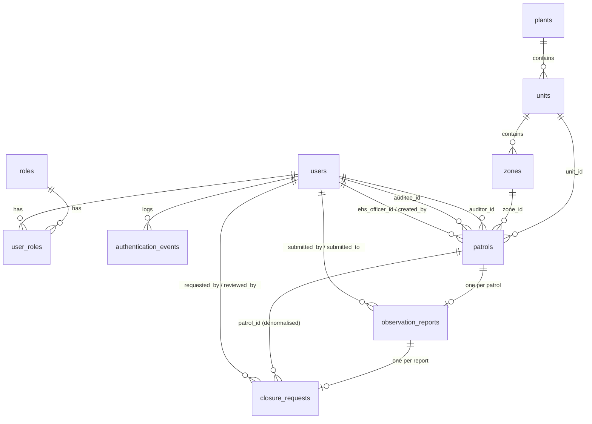

# 3. Data model

Source of truth for the **live** schema is `database-backups/ehs_full_dump.sql` (pg_dump from PostgreSQL 16.15). The numbered files in `backend/database/migrations/` are the intended history but have drifted; see [Migration state](#migration-state) at the bottom before touching them.

## Entity relationship diagram

## Tables

All ids are `BIGSERIAL`. All timestamps are `TIMESTAMPTZ`. Column names are `snake_case` in SQL and mapped to `camelCase` in the repositories.

### Identity

**`roles`** — `id`, `code` (unique: `USER`, `EHS_OFFICER`, `HOD`, `PLANT_HEAD`, `ADMIN`; seeds also add `AUDITOR`, `AUDITEE`), `name`, `created_at`.

**`users`** — `id`, `full_name`, `username`, `email`, `password_hash` (bcrypt, nullable for future SSO), `authentication_source` (`LOCAL` | `ENTRA`), `is_active`, `failed_login_attempts`, `locked_until`, `last_login_at`, `created_at`, `updated_at`.
Unique on `LOWER(username)` and `LOWER(email)`. The `ENTRA` value reserves Microsoft Entra ID SSO; nothing implements it.

**`user_roles`** — `(user_id, role_id)` PK, `assigned_at`. `ON DELETE CASCADE` from users, `RESTRICT` from roles.

**`authentication_events`** — audit log written on every signup, login, and failed login: `user_id` (nullable), `username_attempted`, `event_type` (`SIGNUP` | `LOGIN` | `LOGOUT` | `LOGIN_FAILURE`), `success`, `ip_address` (`INET`), `user_agent`, `event_timestamp`. `LOGOUT` is never written because logout is client-side.

### Location master data

**`plants`** — `id`, `name`, `code` (unique), `is_active`, `created_at`.
**`units`** — `id`, `plant_id`, `name`, `code` (unique per plant), `unit_number`, `is_active`, `created_at`.
**`zones`** — `id`, `unit_id`, `name`, `code` (unique per unit), `zone_number`, `area_detail` (free text description), `is_active`, `created_at`.

The planning UI resolves plant → unit → zone through these tables (`GET /api/patrols/planning-lookups`). Note the mismatch: `patrols.plant_location` and `observation_reports.plant_location` store the plant **name as text** (CHECK-constrained), not `plants.id`.

### Location scoping and per-zone areas (migrations 007, 008)

**`zone_areas`** — level 4 of the division: `id`, `zone_id` (FK, `CASCADE`), `name`, `display_order`, `is_active`, `created_at`. Unique on `(zone_id, name)`. Rows are loaded at production cutover, never seeded.

**`users.plant_id`** — nullable FK to `plants`. For an `EHS_OFFICER` it is the location they may plan audits in; for everyone it decides which auditor and auditee dropdowns they appear in. Replaces selecting staff by the `AUDITOR`/`AUDITEE` role codes, which exist only in the test seeds. **Null on every existing row**; backfill before the Plan page ships.

**`observation_reports.zone_area_id`** — nullable FK to `zone_areas`. A patrol covers a whole zone, so the area is recorded on the report, where the finding actually happened. `patrols` deliberately has no area FK.

Migration 007 also drops the three value CHECK constraints, so a location or area loaded in production is accepted without a code change.

### Workflow tables

**`patrols`**

| Column | Notes |
|---|---|
| `unit_id`, `zone_id` | FK, `RESTRICT` |
| `auditor_id`, `auditee_id` | FK users; CHECK `auditor_id <> auditee_id` |
| `ehs_officer_id` | FK users, nullable; the officer who planned it |
| `created_by` | FK users, nullable |
| `scheduled_date` | `DATE` |
| `plant_location` | text, CHECK in (Gurugram, Manesar, Chennai, Pune, China), nullable for legacy rows |
| `area_detail` | text, CHECK in the nine shop-floor areas, nullable |
| `status` | see [status values](#status-values) |
| `created_at`, `updated_at` | |

Indexes on `scheduled_date`, `(auditor_id, scheduled_date)`, `(auditee_id, scheduled_date)`, `(ehs_officer_id, scheduled_date)`, `(zone_id, scheduled_date)`, `(status, scheduled_date)`. Several are duplicated under two names because migrations 002 and 005 both created them.

**`observation_reports`** — one row per patrol (`patrol_id` is `UNIQUE`, `ON DELETE CASCADE`).

Since migration 013 a report holds **1–10 observations** in `observation_items`, and the per-observation columns below (`observation_location`, `category`, `description`, `risk_category`, `photograph_*`, `zone_area_id`) are kept filled with **observation #1** so every pre-existing query keeps working. `no_observations` marks a report closed with "No observation to record": it has no items and no `closure_requests` row, and its patrol goes straight to `COMPLETED`.

| Column | Notes |
|---|---|
| `submitted_by` | auditor (FK users) |
| `submitted_to` | auditee (FK users) |
| `report_number` | nullable, unique when present; generated by the service |
| `finding_date` | `DATE` |
| `plant_location` | text, CHECK list as above |
| `observation_location` | text copied from the zone/area at submit time |
| `category` | `UA` \| `UC` |
| `description` | text; service limits to 500 words |
| `risk_category` | `HIGH` \| `MEDIUM` \| `LOW` |
| `photograph_path`, `photograph_original_name`, `photograph_mime_type`, `photograph_size` | file stored on disk under `backend/uploads/observations/<uuid>.<ext>`; only the path is in the DB |
| `status` | `OPEN` \| `PENDING_AUDITEE_ACTION` \| `PENDING_EHS_APPROVAL` \| `REEXAMINATION_REQUIRED` \| `CLOSED` |
| `submitted_at`, `updated_at`, `closed_at` | |
| `no_observations` | boolean, default `FALSE`; `TRUE` for a "No observation to record" closure (migration 013) |

**`observation_items`** (migration 013) — 1–10 per report, `UNIQUE (observation_report_id, sequence_number)`, `CHECK sequence_number BETWEEN 1 AND 10`, `ON DELETE CASCADE`.

| Column | Notes |
|---|---|
| `observation_report_id` | FK `observation_reports` |
| `sequence_number` | 1–10, the order the auditor entered them |
| `zone_area_id` | FK `zone_areas`; validated against the patrol's own zone at submit time |
| `observation_location` | area name copied at submit time |
| `category` | `UA` \| `UC`, CHECK |
| `description` | text, service limits to 500 words |
| `risk_category` | `HIGH` \| `MEDIUM` \| `LOW`, CHECK |
| `photograph_path`, `photograph_original_name`, `photograph_mime_type`, `photograph_size` | one photograph per observation, same upload directory |

Index on `(observation_report_id, sequence_number)`. The migration backfills one item per pre-existing report from that report's own columns, so old reports render unchanged.

**`closure_requests`** — one row per observation report (unique index on `observation_report_id`). Created automatically when the report is filed.

Since migration 014 the action plan lives **per observation** in `closure_items`; the columns below keep mirroring **item #1** so every older reader still works, and `status` is derived from the items rather than set directly.

| Column | Notes |
|---|---|
| `observation_report_id`, `patrol_id` | both FKs, `CASCADE`; `patrol_id` is denormalised for query convenience |
| `requested_by` | the auditee who must act (naming is historical; it is *assigned to*, not *requested by*) |
| `responsible_hod_name`, `target_date`, `action_plan`, `action_plan_saved_at` | action-plan phase (`PATCH .../action-plan`) |
| `completion_date`, `submitted_for_closure_at` | submit phase (`POST .../submit`) |
| `reviewed_by`, `reviewed_at`, `review_comments`, `approval_iteration`, `approved_at` | EHS review phase (columns exist from migration 006; **no endpoint writes them yet**) |
| `proposed_closure_date`, `closed_at` | legacy columns from migration 002, unused by current code |
| `status` | `OPEN` \| `IN_PROGRESS` \| `SUBMITTED_FOR_CLOSURE` \| `APPROVED` \| `REJECTED` \| `REEXAMINATION_REQUIRED` |

Note: the column default is still `'REQUESTED'`, which the CHECK constraint rejects. Inserts must always set `status` explicitly (the observation service does).

**`departments`** (migration 016) — master data, plant-scoped, `UNIQUE (plant_id, code)`, loaded at cutover like the location hierarchy (R12). `users.department_id` puts an Action Team HOD in one department; `closure_items.department_id` and `action_tickets.department_id` record which department a plan and its ticket went to.

**`closure_items`** (migration 014) — one per `observation_items` row, `UNIQUE (closure_request_id, sequence_number)` and `UNIQUE (observation_item_id)`, `ON DELETE CASCADE`.

| Column | Notes |
|---|---|
| `closure_request_id` | FK `closure_requests` |
| `observation_item_id` | FK `observation_items`; the observation this plan answers |
| `sequence_number` | matches the observation's own sequence |
| `action_plan`, `target_date`, `responsible_hod_name`, `action_hod_id`, `action_plan_saved_at` | this observation's plan and the department it is assigned to; all nullable until the auditee saves it |

`action_tickets` also gains (migration 016) `department_id`, `submitted_for_approval_at`, `approved_by`/`approved_at`/`approval_comments`, and `reopen_comments`/`reopened_at`/`reopen_count`; its status CHECK now allows `PENDING_APPROVAL` (the EHS Officer's queue), whose state rule is `decision IS NOT NULL AND closure_date IS NULL`. `action_tickets.closure_item_id` (migration 014) points at the item, and the round uniqueness moved from `(closure_request_id, closure_round)` to `(closure_item_id, closure_round)`: one ticket per observation per round. Migration 015 recomputes every migrated closure's derived status once.
## Status values

Three parallel status columns describe one workflow. Which code path moves each one is documented in [05-workflows.md](05-workflows.md).

| `patrols.status` | `observation_reports.status` | `closure_requests.status` |
|---|---|---|
| `SCHEDULED` | — | — |
| `IN_PROGRESS` | — | — |
| `PENDING_AUDITEE_ACTION` | `OPEN` → `PENDING_AUDITEE_ACTION` | `OPEN` → `IN_PROGRESS` |
| `PENDING_EHS_APPROVAL` | `PENDING_EHS_APPROVAL` | `SUBMITTED_FOR_CLOSURE` |
| `REEXAMINATION_REQUIRED` | `REEXAMINATION_REQUIRED` | `REEXAMINATION_REQUIRED` / `REJECTED` |
| `COMPLETED` | `CLOSED` | `APPROVED` |
| `CANCELLED` | — | — |

## Allowed-value lists (must be changed in three places)

| List | Values | Validator | Service | DB |
|---|---|---|---|---|
| Plant location | Gurugram, Pune, Chennai, Manesar, China | `observation.validator.js` (`patrol.validator.js` only length-checks it) | — | CHECK on `patrols`, `observation_reports` |
| Area detail | ETP area, Maintenance Store, Utility, Forge Shop, Machine shop, Heat Treatment, Die Shop, Tool Shop, OSP Store — **one global list, not per zone; violates R11** | frontend `PatrolForm.jsx` only | `patrol.repository.findActivePlanningAreaDetails` returns a different set (zone descriptions) | CHECK on `patrols` |
| Observation category | UA, UC | `observation.validator.js` | `observation.service.js` | CHECK |
| Risk category | HIGH, MEDIUM, LOW | `observation.validator.js` | — | CHECK |
| Statuses | see above | — | services | CHECK |

A refinement candidate is to move these into lookup tables or a single shared constants module; see the backlog.

## Location hierarchy gap (R11)

The requirement is Location → Unit → Zone → **areas fixed per zone**. Levels 1–3 are modelled; level 4 is not, and the two columns that could represent it contradict each other.

**There is no per-zone area table.** `grep -rn "zone_areas\|area_locations"` over `backend/` and `frontend/` returns nothing.

**`zones.area_detail` is a description, not a list.** Live values, one row per zone:

| zone | `area_detail` |
|---|---|
| Zone 4 | `ETP and Utility Area` |
| Test Zone 1 | `Assembly line and material movement area` |
| Test Zone 2 | `Utility area and electrical panel section` |
| Test Zone 3 | `Warehouse and dispatch area` |
| Test Zone 4 | `ETP and chemical storage area` |

**`patrols.area_detail` is a global enum.** Its CHECK permits exactly nine values, the same nine for every zone.

**The two are disjoint.** No value in the zones table appears in the patrols CHECK list. So `patrol.service.js`'s intended step — look up the area configured for the chosen zone, then insert it into `patrols.area_detail` — cannot succeed even once its missing repository function is written: the zone's description would fail the CHECK constraint. Implementing the P0 fix literally produces a `23514` violation.

**Live data confirms the current behaviour is unconstrained.** Patrols 14–17 were all planned in Gurugram Test Unit 1 and carry `Forge Shop`, `ETP area`, `Maintenance Store`, `Machine shop`. Zone 2 alone received three different areas from the global list, and zone 3 received one that has nothing to do with its description.

**`plants` has duplicate rows** (`Gurugram/GGM` id 1 and `Gurugram/TEST-GGM` id 2), which is why `findActivePlanningLocations`, `findActivePlanningUnits`, and `findActivePlanningZones` each carry a `canonical_plants` CTE that picks a winner by patrol count, then unit count, then highest id. Fixing the hierarchy should de-duplicate the table and delete that CTE.

**Resolved by migration 007**, verified against a restore of the production dump: a new city, unit, zone and area set were inserted with plain SQL and a patrol scheduled against them, which the old constraints rejected.

**The three CHECK constraints were themselves hardcoded master data.** `patrols_plant_location_check` and `observation_report_plant_location_check` permit five city names; `patrols_area_detail_check` permits nine area names. Master data is loaded into Postgres at production cutover, so these constraints will reject the first value operations adds that the developers did not anticipate, failing inserts with a `23514` violation until a migration ships. They must be dropped and replaced by foreign keys to `plants` and `zone_areas`, which accept whatever rows exist.

Proposed schema and migration are in [the backlog](09-feature-refinement-backlog.md#r11-location-hierarchy-read-from-the-database).

## Seed / test data

`backend/database/seeds/` (apply manually with `psql`, in order):

- `000_create_required_test_users.sql` — idempotent; creates `test.auditor`, `test.auditee`, `test.ehs.officer`, `test.hod`, `test.plant.head` with password `ChangeMe123!` (hashed via `pgcrypto`'s `crypt(..., gen_salt('bf', 12))`, which `bcryptjs` verifies).
- `001_dashboard_observation_test_data.sql` — requires those users; upserts plants (`TEST-*` codes), two Gurugram units, four zones, then **deletes and recreates** all patrols/reports/closures in `TEST-ZONE-*` zones: four historical completed patrols, one current-week `SCHEDULED`, one `PENDING_AUDITEE_ACTION` with a report, one `COMPLETED` with an approved closure, one Zone 4 `SCHEDULED`, one future patrol (+21 days). Dates are relative to `CURRENT_DATE`, so re-run it to refresh the "current week" fixtures.

The dump also contains real data: 8 users, 16 patrols, 6 reports, 3 closures, 6 plants (the five real ones plus a test duplicate), 33 auth events.

## Migration state

| File | Applies cleanly to empty DB? | Notes |
|---|---|---|
| `001_create_auth_tables.sql` | Yes | **Corrected 2026-09-16.** Declared `users` with `first_name`/`last_name` and no `username` while indexing `LOWER(username)`, which broke the chain at the first file. Now matches the deployed schema. |
| `002_create_patrol_dashboard_tables.sql` | Yes (after 001 fixed) | Original workflow tables |
| `003_create_observation_fields.sql` | Yes | Adds report fields, `patrols.ehs_officer_id`, `unit_number`/`zone_number` |
| `004_extend_closure_workflow.sql` | Yes | Renames closure statuses, migrates legacy rows, adds action-plan columns |
| `005_add_audit_planning.sql` | Yes | `patrols.plant_location`/`area_detail`, duplicate indexes |
| `006_add_closure_approval.sql` | Yes | Review columns for the not-yet-built approval endpoint |
| `007_add_zone_areas.sql` | Yes | `zone_areas`, `observation_reports.zone_area_id`, drops the three master-data CHECK constraints |
| `008_add_user_location.sql` | Yes | `users.plant_id` for officer scoping and staff selection |
| `009_fix_closure_defaults_and_index.sql` | Yes | Closure status default corrected from the rejected `REQUESTED` to `OPEN`; index for the completed-this-week list |

**Verified 2026-09-16.** All nine apply cleanly in order to an empty database, are idempotent on re-run, and the resulting schema passed a 26-point conformance check against every requirement in plans 10, 11 and 12, plus an end-to-end walkthrough of the whole workflow including the reject-and-refill loop.

There is still no migrations table and no runner; nothing records what has been applied. A runner is the remaining piece, in [08-containerization-plan.md](08-containerization-plan.md#database-bootstrap).
