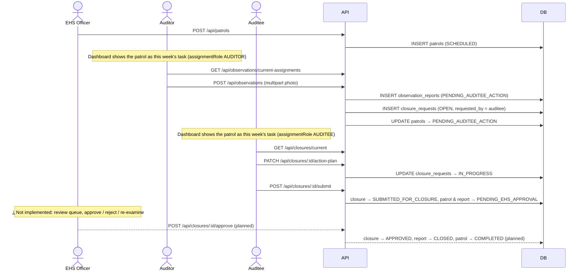
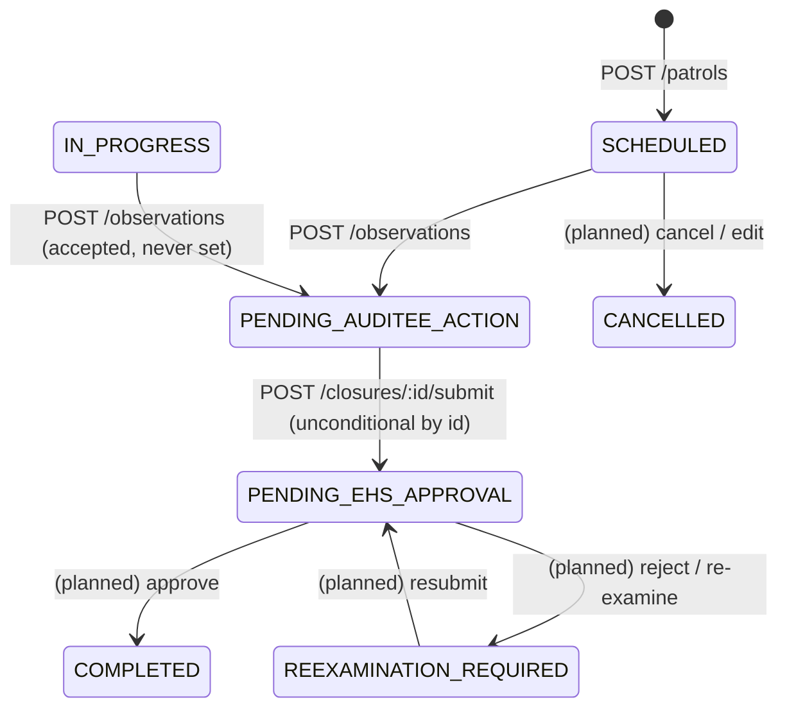
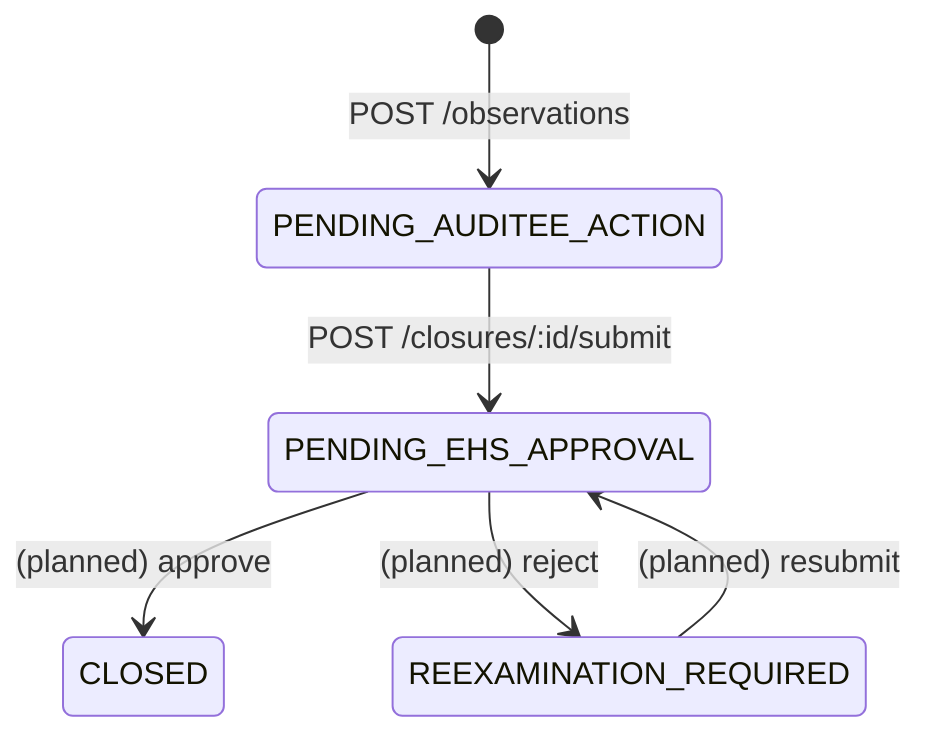
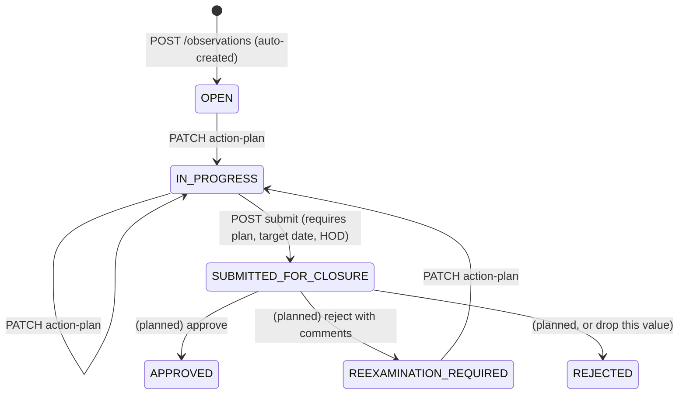

# 5. Workflows and status machines

## End-to-end happy path



## Status machines (what the code actually does)

Legend: solid = implemented transition with its endpoint; dashed = value exists in the DB CHECK constraint but no code path sets it.

### `patrols.status`



Never written today: `IN_PROGRESS`, `REEXAMINATION_REQUIRED`, `COMPLETED`, `CANCELLED`. Queries nevertheless filter on `CANCELLED` (dashboard, conflict check), and the conflict check also excludes `CLOSED`, which is not a legal patrol status (dead predicate).

### `observation_reports.status`



`OPEN` is only the column default and is never inserted by the multi-observation path. **"No observation to record"** (`POST /api/observations/no-observation`) inserts `CLOSED` directly with `no_observations = true`, opens **no** closure, and moves the patrol straight to `COMPLETED` — the one path where an audit finishes without an auditee ever acting.

**The auditor's own view of a report is binary** and derived, not stored: `OPEN` while no report exists, `CLOSED` once one does (either sent to the auditee or closed with no observations). The stored column above still drives the auditee/officer loop. The API also returns `lifecycleStatus`/`lifecycleLabel` summarising the whole journey: `NO_OBSERVATIONS`, `CLOSED_VIA_TICKET` (the latest ticket is `CLOSED` — this wins over a later closure approval), `EHS_OFFICER_ACTION_REQUIRED`, `APPROVED`, `ACTION_PLAN_IN_PROGRESS`, else `WITH_AUDITEE`.

**Deadline.** A report is due by **Thursday of the audit's ISO week** (`dueDate` = Monday + 3 days). Past that it is flagged `isOverdue` and kept in the auditor's pending list for 4 more weeks, but submission is never blocked.

### `action_tickets.status` (docs/17)

```
OPEN ──accept──► IN_PROGRESS ──submit-resolution (1-3 photos + comments)──► PENDING_APPROVAL (ACCEPTED)
  │                                                                          │ approve (officer) → CLOSED
  │                                                                          └ reopen  (officer) → OPEN (cleared)
  └──reject (comments)──► PENDING_APPROVAL (REJECTED) ─ approve → CLOSED
                                                      └ reopen  → OPEN (cleared)
```

The Action Team HOD never closes a ticket: the EHS Officer does, from the Closures page. A reopen deletes the evidence rows and files and clears the HOD's decision, keeping only the plan snapshot and a required reason.

### `closure_requests.status`

Derived, not set by hand (docs/16): `OPEN` while any observation lacks a plan or its department has not accepted the ticket, `IN_PROGRESS` once every observation is with a department, then the existing review loop. The auditee sends the whole closure for approval only once **every** observation's ticket is `CLOSED`; the EHS Officer's approval is what makes it `APPROVED` ("Closed"). A rejection advances `approval_iteration`, reopening every observation for rework with fresh tickets.




Never written: `APPROVED`, `REJECTED`, `REEXAMINATION_REQUIRED`. Migration 006 already added `reviewed_by`, `reviewed_at`, `review_comments`, `approval_iteration`, `approved_at` for this step.

## Who sees what, and when

| Step | Query that surfaces it | Condition |
|---|---|---|
| Auditor's task this week | `GET /dashboard` → `nextAudit` (USER); `GET /observations/current-assignments` | patrol in current ISO week, `auditor_id = me`, status SCHEDULED/IN_PROGRESS, no report yet |
| Auditee's task this week | `GET /dashboard` → `nextAudit` (USER) | patrol in current week, `auditee_id = me`, report status OPEN/PENDING_AUDITEE_ACTION/REEXAMINATION_REQUIRED, and no closure row with `requested_by = me` (note: the closure row *is* auto-created, so this shows "pending" only until the row exists, which is immediately, so in practice the auditee task relies on `hasOpenObservationReport`) |
| Auditee's current closure | `GET /closures/current` | `requested_by = me`, status OPEN/IN_PROGRESS/REEXAMINATION_REQUIRED/SUBMITTED_FOR_CLOSURE, highest priority first |
| EHS review queue | *(planned)* `GET /closures/pending-approvals` | status SUBMITTED_FOR_CLOSURE, ordered by `submitted_for_closure_at` (index exists) |
| Management week view | `GET /dashboard` → `nextWeek` | all non-cancelled patrols in the current week |

## Invariants the code relies on

- One observation report per patrol (unique `patrol_id`); one closure per report (unique `observation_report_id`).
- Closure rows are created by the **observation** module, not the closure module. `requested_by` means "assigned to (auditee)".
- Auditor ≠ auditee (DB CHECK). Auditor/auditee eligibility for planning is by role codes `AUDITOR`/`AUDITEE` (seed-only roles), but observation and closure access is by patrol membership, not role.
- "Today" is server-local in patrols/closures and UTC in the dashboard. Keep containers on one timezone (UTC) and treat this as a refinement item.
- The week window on the dashboard is always the real current week regardless of the `year`/`month` requested.
