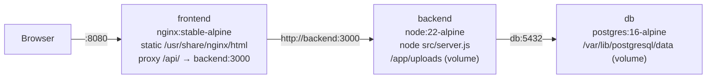

# 8. Containerization plan

**Goal (R10):** one `compose.yaml` that builds and runs three containers — `frontend` (nginx serving the Vite build and proxying `/api`), `backend` (Node/Express), `db` (PostgreSQL) — with persistent DB and upload storage, health-gated startup, and a dev override for hot reload.

Status: **design, not yet implemented.** Today `compose.yaml` only defines Postgres, and its bind mounts are broken (see [Current state](#current-state)).

## Current state

```yaml
# compose.yaml today
services:
  postgres:            # image postgres:16, container_name ehs_postgres, port 5432:5432
    volumes:
      - ehs_postgres_data:/var/lib/postgresql/data
      - ./backend/database/migrations:/docker-entrypoint-initdb.d/migrations:ro   # ignored: initdb does not recurse
      - ./backend/database/init.sql:/docker-entrypoint-initdb.d/001-init.sql:ro   # file does not exist → Docker creates an empty dir
```

Backend and frontend run on the host. Host Node is v12, so in practice nothing runs without a newer Node.

## Target architecture



Design decisions and why:

| Decision | Choice | Reason |
|---|---|---|
| Frontend serving | Multi-stage build → nginx | Vite output is static; nginx gives SPA fallback and a same-origin `/api` proxy so the browser never talks to port 3000 and CORS becomes irrelevant |
| API base URL in the bundle | `VITE_API_BASE_URL=/api` passed as a **build arg** | Vite bakes env at build time; a relative path works on any host/port |
| Backend base image | `node:22-alpine` | Satisfies every engine constraint; small |
| Postgres version | `postgres:16-alpine` | The dump is from 16.15 and the existing `ehs_postgres_data` volume is 16-format. Moving to 17 would require a dump/restore of that volume |
| DB port | not published by default (`127.0.0.1:5432` under the `dev` override) | Nothing on the host needs it in prod-like mode |
| Backend port | `127.0.0.1:3000` only | Debugging with curl; the public entry is the frontend |
| Uploads | named volume `ehs_uploads` mounted at `/app/uploads` | Survives image rebuilds; the app resolves uploads relative to `process.cwd()` = `/app` |
| Config | one root `.env` consumed by compose, mapped into the backend's `DATABASE_*` names | Single place for secrets; backend code unchanged |
| Startup order | `depends_on` with `condition: service_healthy` | Backend exits on DB connection failure; frontend proxy needs backend |
| Project name | `name: ehs-inspection` in compose | Avoids colliding with the sibling `ehs` project's containers/volumes |

## Proposed files

These are drafts to start from; adjust rather than copy blindly.

### `backend/Dockerfile`

```dockerfile
FROM node:22-alpine
WORKDIR /app
ENV NODE_ENV=production
COPY package.json package-lock.json ./
RUN npm ci --omit=dev
COPY src ./src
# multer's destination() does not mkdir; the volume mounts over this path but the
# directory must exist and be writable by the unprivileged user.
RUN mkdir -p uploads/observations && chown -R node:node /app
USER node
EXPOSE 3000
CMD ["node", "src/server.js"]
```

`backend/.dockerignore`: `node_modules`, `uploads`, `.env*`, `database/`.

### `frontend/Dockerfile`

```dockerfile
FROM node:22-alpine AS build
WORKDIR /app
ARG VITE_API_BASE_URL=/api
ENV VITE_API_BASE_URL=$VITE_API_BASE_URL
COPY package.json package-lock.json ./
RUN npm ci
COPY . .
RUN npm run build

FROM nginx:stable-alpine
COPY nginx.conf /etc/nginx/conf.d/default.conf
COPY --from=build /app/dist /usr/share/nginx/html
EXPOSE 80
```

`frontend/.dockerignore`: `node_modules`, `dist`, `.env*`.

Before this works, add `react` and `react-dom` to `frontend/package.json` `dependencies` explicitly; relying on peer-dep auto-install is fragile.

### `frontend/nginx.conf`

```nginx
server {
  listen 80;
  server_name _;
  root /usr/share/nginx/html;
  index index.html;
  client_max_body_size 12m;            # photo uploads are up to 10 MB + multipart overhead

  resolver 127.0.0.11 valid=10s ipv6=off;   # re-resolve "backend" if the container is recreated

  location /api/ {
    set $backend_upstream http://backend:3000;
    proxy_pass $backend_upstream;
    proxy_http_version 1.1;
    proxy_set_header Host $host;
    proxy_set_header X-Real-IP $remote_addr;
    proxy_set_header X-Forwarded-For $proxy_add_x_forwarded_for;
    proxy_set_header X-Forwarded-Proto $scheme;
  }

  location /assets/ {
    add_header Cache-Control "public, max-age=2592000, immutable";
    try_files $uri =404;
  }

  location / {
    add_header Cache-Control "no-cache";
    try_files $uri /index.html;
  }
}
```

`client_max_body_size` is the one thing the sibling project's config lacks that this app needs (nginx defaults to 1 MB and would reject photo uploads with 413).

### `compose.yaml`

```yaml
name: ehs-inspection

services:
  db:
    image: postgres:16-alpine
    restart: unless-stopped
    environment:
      POSTGRES_DB: ${POSTGRES_DB}
      POSTGRES_USER: ${POSTGRES_USER}
      POSTGRES_PASSWORD: ${POSTGRES_PASSWORD}
    volumes:
      - ehs_postgres_data:/var/lib/postgresql/data
      - ./backend/database/schema.sql:/docker-entrypoint-initdb.d/01-schema.sql:ro
    healthcheck:
      test: ["CMD-SHELL", "pg_isready -U $${POSTGRES_USER} -d $${POSTGRES_DB}"]
      interval: 5s
      timeout: 5s
      retries: 20

  backend:
    build: ./backend
    restart: unless-stopped
    environment:
      NODE_ENV: production
      PORT: "3000"
      DATABASE_HOST: db
      DATABASE_PORT: "5432"
      DATABASE_NAME: ${POSTGRES_DB}
      DATABASE_USER: ${POSTGRES_USER}
      DATABASE_PASSWORD: ${POSTGRES_PASSWORD}
      DATABASE_SSL: "false"
      JWT_SECRET: ${JWT_SECRET}
      JWT_EXPIRES_IN: ${JWT_EXPIRES_IN:-8h}
      PASSWORD_SALT_ROUNDS: ${PASSWORD_SALT_ROUNDS:-12}
      FRONTEND_ORIGIN: http://localhost:${APP_PORT:-8080}
    volumes:
      - ehs_uploads:/app/uploads
    depends_on:
      db:
        condition: service_healthy
    ports:
      - "127.0.0.1:3000:3000"
    healthcheck:
      test: ["CMD", "wget", "-qO-", "http://127.0.0.1:3000/api/health"]
      interval: 10s
      timeout: 5s
      retries: 10
      start_period: 15s

  frontend:
    build:
      context: ./frontend
      args:
        VITE_API_BASE_URL: /api
    restart: unless-stopped
    depends_on:
      backend:
        condition: service_healthy
    ports:
      - "${APP_PORT:-8080}:80"

volumes:
  ehs_postgres_data:
  ehs_uploads:
```

Root `.env.example` (compose reads root `.env` automatically):

```
POSTGRES_DB=ehs_inspection
POSTGRES_USER=ehs_app
POSTGRES_PASSWORD=change-me
JWT_SECRET=change-me-to-a-long-random-string
JWT_EXPIRES_IN=8h
APP_PORT=8080
```

The existing volume name `ehs_postgres_data` is kept on purpose. Because the project name changes from the directory default (`ehs-inspection-app`) to `ehs-inspection`, Compose will look for `ehs-inspection_ehs_postgres_data`. If you want to reuse the already-populated volume, either keep the old project name or declare the volume `external: true` with its existing full name (`docker volume ls` shows it).

### `compose.override.yaml` (dev, auto-merged by `docker compose up`)

```yaml
services:
  db:
    ports:
      - "127.0.0.1:5432:5432"
  backend:
    build:
      target: dev            # add a `dev` stage to the Dockerfile that skips --omit=dev and USER node
    environment:
      NODE_ENV: development
      FRONTEND_ORIGIN: http://localhost:5173
    volumes:
      - ./backend/src:/app/src:ro
    command: ["node", "--watch", "src/server.js"]
  frontend:
    build:
      target: build
    command: ["npm", "run", "dev", "--", "--host"]
    volumes:
      - ./frontend:/app
      - /app/node_modules
    ports:
      - "5173:5173"
```

In dev the browser hits Vite on 5173 and Vite calls `VITE_API_BASE_URL` (set `http://localhost:3000/api` in `frontend/.env`), so CORS applies and `FRONTEND_ORIGIN` must be `http://localhost:5173`. Alternatively add a Vite `server.proxy` for `/api` and keep `/api` everywhere. Name the file `compose.prod.yaml`-style and use `-f` if you would rather not have the override apply by default.

## Database bootstrap

Postgres runs `/docker-entrypoint-initdb.d/*.sql` **only when the data volume is empty**, only top-level files, in lexical order.

**Migrations 001-009 now build the full schema from empty and are idempotent** (verified 2026-09-16), so the baseline-snapshot step below is no longer required. The simplest bootstrap is a runner that applies every unapplied migration on backend start, which also handles upgrades rather than only first boot. Steps 1 and 3 are kept for reference if you would rather pin a snapshot. Plan:

1. **Create a baseline** `backend/database/schema.sql` from the live DB:
   `pg_dump --schema-only --no-owner --no-privileges -U ehs_app ehs_inspection > backend/database/schema.sql`
   (or strip the `COPY` sections from `database-backups/ehs_full_dump.sql`). Mount it as `01-schema.sql`.
2. **Seed roles** in the same file or a `02-roles.sql` (the five role rows are the only data the app needs to function).
3. **Fix `migrations/001`** to match the baseline (or archive 001–006 into `migrations/archive/` and start a fresh numbering from the baseline). Decide one and document it in `backend/database/README.md`.
4. **Add a migration runner** so future schema changes apply on container start. Smallest option: a `schema_migrations(filename, applied_at)` table and a `node scripts/migrate.js` that runs unapplied files in a transaction, invoked from the backend `CMD` via a tiny entrypoint script before `node src/server.js`. `node-pg-migrate` is the off-the-shelf alternative.
5. **Test fixtures**: keep seeds out of initdb. Provide `make seed` / `npm run seed` that pipes `backend/database/seeds/*.sql` into `docker compose exec -T db psql`.
6. **Restoring the real data** into a fresh volume: `docker compose exec -T db psql -U $POSTGRES_USER -d $POSTGRES_DB < database-backups/ehs_full_dump.sql` *before* any schema file has run, i.e. use an empty `initdb.d` for that one-off, or accept the "already exists" errors.

## Application code changes required

Small, and all in the backlog too:

- `frontend/.env`: rename `VITE_API_URL` → `VITE_API_BASE_URL`.
- `frontend/package.json`: declare `react`, `react-dom`.
- `backend`: nothing mandatory. Optional: create the uploads directory at startup in `server.js` (`fs.mkdirSync(..., { recursive: true })`) so the app is not dependent on the Dockerfile doing it.
- Remove the duplicate `notFoundHandler`/`errorHandler` registration in `app.js` while there.
- `.gitignore` at root: `node_modules/`, `dist/`, `.env`, `backend/uploads/`, `*.log`. Then `git rm --cached backend/.env frontend/.env backend/uploads -r` and rotate the JWT secret that was committed.

## Implementation checklist

1. Add `.gitignore`; untrack `.env` files and uploads; create root `.env.example`.
2. Create `backend/database/schema.sql` baseline and `02-roles.sql`; decide the migrations policy.
3. Write `backend/Dockerfile`, `backend/.dockerignore`.
4. Write `frontend/Dockerfile`, `frontend/.dockerignore`, `frontend/nginx.conf`; fix `frontend/.env` and `package.json`.
5. Replace `compose.yaml`; add `compose.override.yaml` for dev.
6. `docker compose build && docker compose up -d`; wait for all three `healthy`/running.
7. Run the acceptance checks below. Commit.
8. Update `CLAUDE.md` "Commands" and `docs/07-environment-and-config.md` to describe the container workflow as the primary one.

## Acceptance checks

| # | Check | Expected |
|---|---|---|
| 1 | `curl -s localhost:3000/api/health` | `{"status":"healthy",...}` |
| 2 | `curl -s localhost:8080/api/health` | same body via nginx proxy |
| 3 | Open `http://localhost:8080`, sign up a user, sign in | Redirected to `/dashboard`; JWT in localStorage |
| 4 | Sign in as `test.ehs.officer` (after seeding), plan a patrol on `/plan` | 201, patrol visible on dashboard calendar |
| 5 | Sign in as `test.auditor`, submit an observation with a 5 MB photo | 201; `docker compose exec backend ls /app/uploads/observations` shows the file |
| 6 | `docker compose restart backend`, reload the photo URL | Still served (uploads volume) |
| 7 | `docker compose down && docker compose up -d` | Users and patrols still present (db volume) |
| 8 | `docker compose down -v && up -d` | Fresh DB with schema + roles, no test data, app boots |
| 9 | Deep-link `http://localhost:8080/closures` in a new tab | SPA fallback serves the app, not 404 |
| 10 | Kill the DB while the backend runs, restart it | Backend pool recovers on next request (no crash) |

## Later (not needed for R10)

- HTTPS termination (Caddy/Traefik in front of `frontend`, or nginx with certs).
- Log shipping: backend already emits JSON lines to stdout, so `docker compose logs` or any collector works.
- Backups: a `pg_dump` cron sidecar writing to a host bind mount, replacing the manual `database-backups/` file.
- Object storage for photos if the app ever runs on more than one host.
