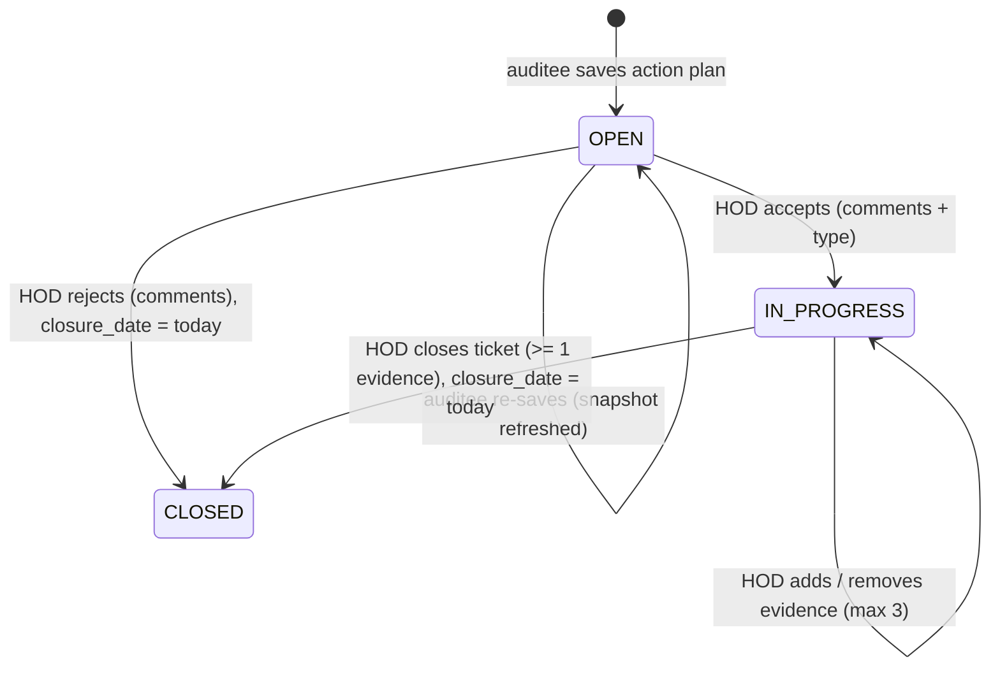

# 13. Action tickets: corrective-action tracking for the Action Team HOD

Implementation plan for the **Ticket** feature. Written to be implemented file by file without further design decisions. Read [02-architecture.md](02-architecture.md) for the layering rules first; every new file below follows them.

**Goal**

1. A new application role, `ACTION_HOD` (Action Team HOD), whose only page is **Ticket**.
2. When the auditee saves an action plan they **assign it to an Action HOD** chosen from a dropdown. That opens a **ticket** for the HOD carrying the observation report, the proposed action plan and the target date.
3. The HOD **accepts** (ticket goes In Progress) or **rejects** (ticket closes) the plan with comments and a corrective-action type, then, after the work is done on the ground, attaches **up to 3 evidence photographs** and **closes the ticket**.
4. The auditee and the EHS Officer can see the ticket's decision, comments, evidence and closure date on the closure they already work with.

**Non-regression rule.** Nothing in the existing plan → observe → close → approve workflow changes its behaviour. Specifically: `POST /closures/:id/submit` and `POST /closures/:id/approve` do **not** wait for the ticket; the observation, plan, dashboard and approval pages keep their current data and routes. The only visible change for an existing user is that the "Responsible HOD" free-text box on the closure form becomes a dropdown of registered Action HODs (section [Auditee side](#auditee-side-assigning-the-ticket)).

## Decisions taken in this plan

These were not fully specified. Each was chosen to be the simplest reading that keeps the existing workflow intact. Change them here before implementing if any is wrong.

| # | Decision | Why |
|---|---|---|
| D1 | Role code is `ACTION_HOD`, display name "Action Team HOD". It is **not** the existing `HOD` role, which is a management role with a plant-wide dashboard. | Existing `HOD` semantics stay untouched. |
| D2 | An Action HOD account holds **only** `ACTION_HOD`, not `USER`. Accounts are created by signup (which grants `USER`) and then re-roled by SQL; there is no admin UI. | Routes gated with `authorize("USER")` then reject the HOD naturally, matching "should not be visible". |
| D3 | The ticket is created (or refreshed) when the auditee **saves** the action plan, not when they submit for closure. | The HOD needs the plan before the work happens; submission happens after. |
| D4 | One ticket per closure **per approval round** (`closure_requests.approval_iteration` at save time). When the officer sends a closure back and the auditee writes a new plan, a new ticket is opened; the earlier one is kept as history. | Matches the closure loop: a rejected plan is cleared and replaced. |
| D5 | While a ticket is `OPEN`, re-saving the plan updates the ticket's snapshot (plan, target date, HOD). Once the HOD has acted, saves no longer touch that ticket. | The HOD's decision refers to a fixed text. |
| D6 | **Reject closes the ticket immediately** (`CLOSED`, decision `REJECTED`, closure date = today). Accept moves it to `IN_PROGRESS`; **Close ticket** then requires at least one evidence photograph. | Follows the stated status rule "closed if rejected, in progress if accepted, closed when the HOD clicks close ticket". |
| D7 | Comments are **required** for both accept and reject; corrective-action type is required for accept, optional for reject. | Spec: comments explain "why it was rejected or accepted". |
| D8 | Corrective-action types live in a **lookup table** seeded by the migration, not in code. | The list ends in "etc." and will grow per site; a table avoids a redeploy, consistent with the R12 rule for master data. |
| D9 | The Action HOD dropdown lists active `ACTION_HOD` users **at the patrol's plant**. | Same location rule as auditor/auditee selection; depends on the `users.plant_id` backfill already required by the Plan page. |
| D10 | The HOD's Closed list shows tickets closed in the **last 30 days**. Open and In Progress are unbounded. | Same shape as the Closure page's "completed in the last 7 days". |
| D11 | Closing a ticket accepts an optional `completionNotes` text (what was done on the ground). Not in the spec; drop it if unwanted. | Evidence photos alone rarely explain the fix. |

## Data model

One migration, `backend/database/migrations/010_add_action_tickets.sql`, idempotent like the others, wrapped in `BEGIN; ... COMMIT;`.

### Role

```sql
INSERT INTO roles (code, name)
VALUES ('ACTION_HOD', 'Action Team HOD')
ON CONFLICT (code) DO UPDATE SET name = EXCLUDED.name;
```

### Closure → Action HOD link

`closure_requests.responsible_hod_name` stays and keeps being filled (with the chosen user's `full_name`) so every existing query, response field and display keeps working. The new column records *which* user it is.

```sql
ALTER TABLE closure_requests
ADD COLUMN IF NOT EXISTS action_hod_id BIGINT REFERENCES users(id);

CREATE INDEX IF NOT EXISTS closure_requests_action_hod_index
ON closure_requests (action_hod_id);
```

### Corrective action types (lookup)

```sql
CREATE TABLE IF NOT EXISTS corrective_action_types (
    id            BIGSERIAL PRIMARY KEY,
    code          VARCHAR(50)  NOT NULL UNIQUE,
    name          VARCHAR(100) NOT NULL,
    display_order INTEGER      NOT NULL DEFAULT 0,
    is_active     BOOLEAN      NOT NULL DEFAULT TRUE,
    created_at    TIMESTAMPTZ  NOT NULL DEFAULT NOW()
);

INSERT INTO corrective_action_types (code, name, display_order) VALUES
    ('ELECTRICAL_WORK',        'Electrical work',            10),
    ('MECHANICAL_MAINTENANCE', 'Mechanical maintenance',     20),
    ('CIVIL_WORK',             'Civil work',                 30),
    ('UTILITY_WORK',           'Utility work',               40),
    ('CLEANING_HOUSEKEEPING',  'Cleaning / housekeeping',    50),
    ('SIGNAGE_MARKING',        'Signage and floor marking',  60),
    ('PPE_ISSUE',              'PPE issue',                  70),
    ('TRAINING_AWARENESS',     'Training / awareness',       80),
    ('OTHER',                  'Other',                      90)
ON CONFLICT (code) DO NOTHING;
```

### Tickets

```sql
CREATE TABLE IF NOT EXISTS action_tickets (
    id                        BIGSERIAL PRIMARY KEY,

    closure_request_id        BIGINT NOT NULL REFERENCES closure_requests(id)   ON DELETE CASCADE,
    observation_report_id     BIGINT NOT NULL REFERENCES observation_reports(id) ON DELETE CASCADE,
    patrol_id                 BIGINT NOT NULL REFERENCES patrols(id)            ON DELETE CASCADE,

    /* approval_iteration of the closure when the ticket was opened (D4) */
    closure_round             INTEGER NOT NULL DEFAULT 0,

    action_hod_id             BIGINT NOT NULL REFERENCES users(id) ON DELETE RESTRICT,
    assigned_by               BIGINT NOT NULL REFERENCES users(id) ON DELETE RESTRICT, -- the auditee

    /* snapshot of the closure at assignment (D5) */
    action_hod_name           VARCHAR(150) NOT NULL,
    proposed_action_plan      TEXT         NOT NULL,
    target_date               DATE         NOT NULL,

    status                    VARCHAR(20)  NOT NULL DEFAULT 'OPEN',
    decision                  VARCHAR(20),
    comments                  VARCHAR(1000),
    corrective_action_type_id BIGINT REFERENCES corrective_action_types(id),
    completion_notes          VARCHAR(1000),

    assigned_at               TIMESTAMPTZ NOT NULL DEFAULT NOW(),
    decided_at                TIMESTAMPTZ,
    closure_date              DATE,
    closed_at                 TIMESTAMPTZ,
    created_at                TIMESTAMPTZ NOT NULL DEFAULT NOW(),
    updated_at                TIMESTAMPTZ NOT NULL DEFAULT NOW(),

    CONSTRAINT action_tickets_status_check
        CHECK (status IN ('OPEN', 'IN_PROGRESS', 'CLOSED')),

    CONSTRAINT action_tickets_decision_check
        CHECK (decision IS NULL OR decision IN ('ACCEPTED', 'REJECTED')),

    /* the three states are mutually consistent with decision and closure date */
    CONSTRAINT action_tickets_state_consistency_check CHECK (
           (status = 'OPEN'        AND decision IS NULL       AND closure_date IS NULL)
        OR (status = 'IN_PROGRESS' AND decision = 'ACCEPTED'  AND closure_date IS NULL)
        OR (status = 'CLOSED'      AND decision IS NOT NULL   AND closure_date IS NOT NULL)
    ),

    CONSTRAINT action_tickets_closure_round_unique
        UNIQUE (closure_request_id, closure_round)
);

CREATE INDEX IF NOT EXISTS action_tickets_hod_status_index
ON action_tickets (action_hod_id, status);

CREATE INDEX IF NOT EXISTS action_tickets_hod_closed_index
ON action_tickets (action_hod_id, closure_date DESC)
WHERE status = 'CLOSED';

CREATE TABLE IF NOT EXISTS action_ticket_evidence (
    id            BIGSERIAL PRIMARY KEY,
    ticket_id     BIGINT NOT NULL REFERENCES action_tickets(id) ON DELETE CASCADE,
    file_path     TEXT   NOT NULL,
    original_name TEXT,
    mime_type     VARCHAR(100),
    size          BIGINT,
    uploaded_by   BIGINT NOT NULL REFERENCES users(id),
    uploaded_at   TIMESTAMPTZ NOT NULL DEFAULT NOW()
);

CREATE INDEX IF NOT EXISTS action_ticket_evidence_ticket_index
ON action_ticket_evidence (ticket_id);
```

The **maximum of 3 evidence files** is enforced in the service inside a transaction (`SELECT ... FOR UPDATE` on the ticket row, then count), not by a constraint.

### Ticket status machine



The ticket never moves the closure, the report or the patrol. If the closure is approved while its ticket is still open, the ticket stays open; the HOD can still close it. Do not auto-close.

## Backend

### Constants — `backend/src/shared/constants/roles.js`

Add `ACTION_HOD: "ACTION_HOD"` to `USER_ROLES` and

```js
/* Roles that work tickets. Read access for others is decided per row. */
export const TICKET_ROLES = Object.freeze([USER_ROLES.ACTION_HOD]);
```

Do **not** add `ACTION_HOD` to `MANAGEMENT_ROLES` or `PLANNING_ROLES`.

### Auth — `backend/src/modules/auth/auth.service.js`

`determineRedirectPath(roles)`: return `"/tickets"` when `roles.includes(USER_ROLES.ACTION_HOD)`, checked **before** the officer/admin branch. Nothing else changes; signup still grants only `USER`.

### Uploads — new `backend/src/modules/tickets/ticketUpload.js`

Copy `observations/observationUpload.js` and change:

- directory `uploads/tickets` (same `process.cwd()` base),
- `upload.array("evidence", 3)` instead of `upload.single`,
- `limits: { fileSize: 10 MB, files: 3 }`,
- error mapping: `LIMIT_FILE_SIZE` → `"Each evidence photograph must be 10 MB or smaller."` (`EVIDENCE_IMAGE_TOO_LARGE`), `LIMIT_FILE_COUNT` and `LIMIT_UNEXPECTED_FILE` → `"Up to 3 evidence photographs can be attached."` (`TOO_MANY_EVIDENCE_IMAGES`), unsupported type → `UNSUPPORTED_EVIDENCE_IMAGE`.

Exports: `uploadTicketEvidence`, `handleTicketUploadError`.

Also:

- `backend/src/server.js`: add a second `fs.mkdirSync` for `uploads/tickets` next to the existing one.
- `backend/Dockerfile`: `RUN mkdir -p uploads/observations uploads/tickets && ...`.
- `frontend/nginx.conf`: `client_max_body_size 32m;` (three 10 MB files plus multipart overhead; the current 12m rejects a full upload with a 413 before it reaches the API).

### Tickets module — new `backend/src/modules/tickets/`

Five files plus `ticketUpload.js`, mounted in `app.js` as `app.use("/api/tickets", ticketRoutes)` after `patrolRoutes`.

#### `ticket.repository.js`

`mapTicket(row)` maps to camelCase. Base `TICKET_SELECT` joins, in this order: `action_tickets AS ticket` → `closure_requests AS closure_request` → `observation_reports AS observation_report` → `patrols AS patrol` → `units AS unit` → `zones AS zone` → `users AS auditor`, `users AS auditee`, `users AS action_hod` → `LEFT JOIN users AS ehs_officer` → `LEFT JOIN zone_areas AS report_area ON report_area.id = observation_report.zone_area_id` → `LEFT JOIN corrective_action_types AS action_type`. Select the ticket columns plus `observation_report.report_number, finding_date, category, risk_category, description AS observation_description, observation_location, zone_area_id, report_area.name AS area_name, photograph_path`, `patrol.scheduled_date`, `unit.name AS unit_name, unit.unit_number`, `zone.name AS zone_name, zone.zone_number`, `auditor.full_name AS auditor_name`, `auditee.full_name AS auditee_name`, `ehs_officer.full_name AS ehs_officer_name`, `action_type.code AS corrective_action_type_code, action_type.name AS corrective_action_type_name`, and `closure_request.status AS closure_status`.

Read access predicate, used by every by-id lookup (mirrors `findClosureByIdForUser`):

```sql
AND (
  ticket.action_hod_id = $2
  OR closure_request.requested_by = $2
  OR patrol.auditor_id = $2
  OR patrol.auditee_id = $2
  OR patrol.ehs_officer_id = $2
)
```

Functions (all take an optional trailing `client = databasePool`):

| Function | Query |
|---|---|
| `findTicketsForHod({ hodId, closedDaysBack })` | `TICKET_SELECT WHERE ticket.action_hod_id = $1 AND (ticket.status <> 'CLOSED' OR ticket.closure_date >= CURRENT_DATE - $2::INTEGER) ORDER BY CASE status OPEN=0, IN_PROGRESS=1, CLOSED=2, ticket.target_date, ticket.id` |
| `findTicketByIdForUser({ ticketId, userId })` | `TICKET_SELECT WHERE ticket.id = $1 AND (<predicate>) LIMIT 1` |
| `findTicketByIdForHod({ ticketId, hodId })` | `WHERE ticket.id = $1 AND ticket.action_hod_id = $2`; add `FOR UPDATE OF ticket` when called inside a transaction (pass a flag) |
| `findLatestTicketForClosure(closureId)` | `WHERE ticket.closure_request_id = $1 ORDER BY closure_round DESC LIMIT 1` |
| `findEvidenceForTicket(ticketId)` | rows from `action_ticket_evidence ORDER BY uploaded_at, id` |
| `findEvidenceByIdForUser({ ticketId, evidenceId, userId })` | evidence row joined to `TICKET_SELECT`'s FROM chain with the read predicate; returns `file_path, original_name, mime_type` |
| `countEvidence(ticketId)` | `COUNT(*)` |
| `insertEvidence({ ticketId, files, uploadedBy })` | one multi-row `INSERT ... RETURNING` |
| `deleteEvidence({ ticketId, evidenceId })` | `DELETE ... RETURNING file_path` |
| `acceptTicket({ ticketId, hodId, comments, correctiveActionTypeId })` | `UPDATE ... SET status='IN_PROGRESS', decision='ACCEPTED', comments, corrective_action_type_id, decided_at=NOW(), updated_at=NOW() WHERE id=$ AND action_hod_id=$ AND status='OPEN' RETURNING id` |
| `rejectTicket({ ticketId, hodId, comments, correctiveActionTypeId })` | same but `status='CLOSED', decision='REJECTED', closure_date=CURRENT_DATE, closed_at=NOW()` |
| `closeTicket({ ticketId, hodId, completionNotes })` | `SET status='CLOSED', closure_date=CURRENT_DATE, closed_at=NOW(), completion_notes ... WHERE ... AND status='IN_PROGRESS' RETURNING id` |
| `findActiveCorrectiveActionTypes()` | `WHERE is_active ORDER BY display_order, name` |
| `findCorrectiveActionTypeById(id)` | active only; `null` when missing |

The `WHERE ... AND status = '<expected>'` on the three writes is the concurrency guard; a `null` return means the row was already moved and the service reports `TICKET_STATUS_CHANGED` (409), the same pattern as `reviewClosure`.

#### `ticket.service.js`

`createTicketResponse(ticket)` adds:

```js
displayStatus: { OPEN: "Open", IN_PROGRESS: "In Progress", CLOSED: "Closed" }[status],
displayDecision: decision === "ACCEPTED" ? "Accepted" : decision === "REJECTED" ? "Rejected" : null,
canDecide:  status === "OPEN",
canAddEvidence: status === "IN_PROGRESS",
canClose:   status === "IN_PROGRESS" && evidenceCount >= 1,
isOverdue:  status !== "CLOSED" && targetDate < today,
```

| Export | Behaviour |
|---|---|
| `getHodTickets({ userId })` | `findTicketsForHod` with `CLOSED_WINDOW_DAYS = 30`; attach `evidenceCount` (one grouped count query, not N+1); split into `open`, `inProgress`, `closed`; return `{ closedWindowDays, openCount, inProgressCount, closedCount, open, inProgress, closed }` |
| `getTicketById({ userId, ticketId })` | `findTicketByIdForUser` → 404 `TICKET_NOT_FOUND`; attach `evidence: [{ id, originalName, mimeType, size, uploadedAt }]`; return `{ ticket }` |
| `getTicketLookups()` | `{ correctiveActionTypes: [{ id, code, name }] }` |
| `decideTicket({ userId, ticketId, accept, comments, correctiveActionTypeId })` | comments required (`TICKET_COMMENTS_REQUIRED`, 400); on accept, `correctiveActionTypeId` required and must resolve via `findCorrectiveActionTypeById` (`INVALID_CORRECTIVE_ACTION_TYPE`, 400); inside `withTransaction`: `findTicketByIdForHod` with lock → 404 `TICKET_NOT_FOUND`; status must be `OPEN` → 409 `TICKET_NOT_OPEN`; call `acceptTicket` / `rejectTicket`; `null` → 409 `TICKET_STATUS_CHANGED`. Return `{ message: "Action plan accepted." / "Action plan rejected and ticket closed.", ticket }` re-read via `getTicketById` |
| `acceptTicket(input)` / `rejectTicket(input)` | thin wrappers around `decideTicket` |
| `addEvidence({ userId, ticketId, files })` | no files → 400 `EVIDENCE_REQUIRED`; inside `withTransaction`: lock ticket, must be `IN_PROGRESS` → 409 `TICKET_NOT_IN_PROGRESS`; `countEvidence + files.length > 3` → 400 `TOO_MANY_EVIDENCE_IMAGES` ("This ticket can hold 3 evidence photographs; N more can be added."); `insertEvidence`. **On any failure unlink every uploaded file** (copy `safelyDeleteFile` from the observation service). Return `{ message: "Evidence added.", ticket }` |
| `removeEvidence({ userId, ticketId, evidenceId })` | lock ticket, must be `IN_PROGRESS`; `deleteEvidence` → 404 `EVIDENCE_NOT_FOUND`; unlink the file **after** commit |
| `closeTicket({ userId, ticketId, completionNotes })` | lock ticket, must be `IN_PROGRESS` → 409 `TICKET_NOT_IN_PROGRESS`; `countEvidence >= 1` else 400 `EVIDENCE_REQUIRED_TO_CLOSE` ("Attach at least one evidence photograph before closing the ticket."); `closeTicket` repo; return `{ message: "Ticket closed.", ticket }` |
| `getEvidenceFile({ userId, ticketId, evidenceId })` | same shape and path-containment check as `getObservationPhotograph`, rooted at `uploads/tickets`; 404 `EVIDENCE_NOT_FOUND` / `EVIDENCE_FILE_NOT_FOUND` |

#### `ticket.validator.js`

- `ticketIdValidationRules`: `param("ticketId").isInt({ min: 1 }).toInt()`.
- `evidenceIdValidationRules`: `...ticketIdValidationRules, param("evidenceId").isInt({ min: 1 }).toInt()`.
- `acceptTicketValidationRules`: `...ticketIdValidationRules, body("comments").trim().notEmpty().bail().isLength({ min: 3, max: 1000 })`, `body("correctiveActionTypeId").notEmpty().bail().isInt({ min: 1 }).toInt()`.
- `rejectTicketValidationRules`: same comments rule; `correctiveActionTypeId` `.optional({ nullable: true }).isInt({ min: 1 }).toInt()`.
- `closeTicketValidationRules`: `...ticketIdValidationRules, body("completionNotes").optional({ nullable: true }).trim().isLength({ max: 1000 })`.

Messages are full sentences ending in a period, like the closure validator.

#### `ticket.controller.js`

Thin, one function per route, `req.user.id` → service → `res.status(...).json(result)`. `getTicketEvidence` streams with `res.type`, `Content-Disposition: inline`, `Cache-Control: private, max-age=300`, `res.sendFile`, copied from `getObservationPhotograph`. `addEvidence` passes `req.files`.

#### `ticket.routes.js`

Register in this order (literal paths before parameterised ones):

| Method | Path | Middleware | Controller |
|---|---|---|---|
| GET | `/` | `authenticate, authorize(...TICKET_ROLES)` | `getHodTickets` |
| GET | `/lookups` | `authenticate` | `getTicketLookups` |
| GET | `/:ticketId` | `authenticate, ticketIdValidationRules, validate` | `getTicketById` (row predicate decides access) |
| GET | `/:ticketId/evidence/:evidenceId` | `authenticate, evidenceIdValidationRules, validate` | `getTicketEvidence` |
| POST | `/:ticketId/accept` | `authenticate, authorize(...TICKET_ROLES), acceptTicketValidationRules, validate` | `acceptTicket` |
| POST | `/:ticketId/reject` | `authenticate, authorize(...TICKET_ROLES), rejectTicketValidationRules, validate` | `rejectTicket` |
| POST | `/:ticketId/evidence` | `authenticate, authorize(...TICKET_ROLES), ticketIdValidationRules, validate, uploadTicketEvidence, handleTicketUploadError` | `addEvidence` |
| DELETE | `/:ticketId/evidence/:evidenceId` | `authenticate, authorize(...TICKET_ROLES), evidenceIdValidationRules, validate` | `removeEvidence` |
| POST | `/:ticketId/close` | `authenticate, authorize(...TICKET_ROLES), closeTicketValidationRules, validate` | `closeTicket` |

Note the evidence POST validates the id **before** multer runs, so a bad id never writes files to disk.

### Closures module changes

These are the only edits to existing backend code.

**`closure.repository.js`**

1. `CLOSURE_SELECT`: add `closure_request.action_hod_id`, `LEFT JOIN users AS action_hod ON action_hod.id = closure_request.action_hod_id` selecting `action_hod.full_name AS action_hod_name`, and

   ```sql
   LEFT JOIN LATERAL (
     SELECT t.id, t.status, t.decision, t.closure_date, t.closure_round
     FROM action_tickets AS t
     WHERE t.closure_request_id = closure_request.id
     ORDER BY t.closure_round DESC
     LIMIT 1
   ) AS latest_ticket ON TRUE
   ```

   selecting `latest_ticket.id AS ticket_id, latest_ticket.status AS ticket_status, latest_ticket.decision AS ticket_decision, latest_ticket.closure_date AS ticket_closure_date`. `mapClosure` adds `actionHodId`, `actionHodName`, `ticketId`, `ticketStatus`, `ticketDecision`, `ticketClosureDate` (all nullable).
2. `findClosureByIdForUser`: add `OR closure_request.action_hod_id = $2` to the OR list so the HOD can open the closure the ticket points at.
3. `saveActionPlan`: take `actionHodId` and set `action_hod_id = $n` alongside `responsible_hod_name`. Add to the `RETURNING` list `approval_iteration, observation_report_id, patrol_id` (the ticket upsert needs them).
4. New `findActionHodsForClosure({ closureId, auditeeId })`: active users holding role `ACTION_HOD` whose `plant_id` equals the plant of the closure's patrol (`closure_requests → patrols → units.plant_id`), restricted to `closure_request.requested_by = $2`. Returns `[{ id, fullName, username, email }]` ordered by `full_name`.
5. New `upsertTicketForClosureRound({ closureId, observationReportId, patrolId, closureRound, actionHodId, actionHodName, proposedActionPlan, targetDate, assignedBy }, client)` following the precedent of `observation.repository.createClosureAssignment` (the module that triggers a row owns its insert):

   ```sql
   INSERT INTO action_tickets (...)
   VALUES (...)
   ON CONFLICT (closure_request_id, closure_round) DO UPDATE
   SET action_hod_id        = EXCLUDED.action_hod_id,
       action_hod_name      = EXCLUDED.action_hod_name,
       proposed_action_plan = EXCLUDED.proposed_action_plan,
       target_date          = EXCLUDED.target_date,
       assigned_at          = NOW(),
       updated_at           = NOW()
   WHERE action_tickets.status = 'OPEN'
   RETURNING id, status
   ```

   The `WHERE` on the `DO UPDATE` implements D5: a ticket the HOD has already acted on is left alone (the statement then returns no row, which is not an error).

**`closure.service.js` → `saveActionPlan`**

- New input `actionHodId` (required). `responsibleHodName` is no longer accepted from the client; it is derived.
- Validation: `actionHodId` must appear in `findActionHodsForClosure` for this closure → else 400 `INVALID_ACTION_HOD` ("Select an Action Team HOD registered at this location.").
- Wrap the existing save in `withTransaction`: `saveActionPlan` repo (with `responsibleHodName = hod.fullName`), then `upsertTicketForClosureRound` with `closureRound = saved.approval_iteration`. Keep every existing status check and error code exactly as they are.
- `createClosureResponse` passes the six new fields through unchanged (spread already does) and adds `ticketDisplayStatus` using the same label map as the ticket service.
- `getClosureById` additionally attaches `ticket` (full ticket response with evidence, from `ticketService.getTicketById` when `closure.ticketId` is set; `null` otherwise) so the auditee and officer views need no second round trip.

**`closure.validator.js` → `saveActionPlanValidationRules`**: replace the `responsibleHodName` rule with `body("actionHodId").notEmpty().withMessage("Select the Action Team HOD responsible for this plan.").bail().isInt({ min: 1 }).toInt()`.

**`closure.routes.js`**: add `GET /:closureId/action-hods` (`authenticate, closureIdValidationRules, validate, getActionHodOptions`) **before** `PATCH /:closureId/action-plan`. Service returns `{ actionHods: [...], plantName }`; empty list is a 200 with an empty array (the form explains it).

**`observation.repository.js` → `findPhotographByReportId`**: extend its ownership `OR` list with

```sql
OR EXISTS (
  SELECT 1 FROM action_tickets AS t
  WHERE t.observation_report_id = observation_report.id
    AND t.action_hod_id = $2
)
```

so the ticket page can show the observation photograph through the existing `GET /observations/:reportId/photograph`.

### Access summary

| Endpoint | Who |
|---|---|
| `GET /tickets`, accept, reject, evidence add/remove, close | `ACTION_HOD` only, and only on tickets where `action_hod_id` = caller (checked in SQL) |
| `GET /tickets/:id`, `GET /tickets/:id/evidence/:evidenceId` | the HOD, the auditee, the auditor, the patrol's officer (row predicate) |
| `GET /tickets/lookups` | any authenticated user |
| `GET /closures/:id/action-hods` | the closure's auditee |
| `GET /closures/:id` | existing set plus the assigned HOD |

Dashboard routes have no `authorize` today; an `ACTION_HOD`-only account that calls them by hand gets an empty "own patrols" view. Nothing to change; the frontend never links there for them.

## Frontend

### Roles and routing

**`src/constants/roles.js`**: add `ACTION_HOD` to `APP_ROLES`; `TICKET_ROLES = [APP_ROLES.ACTION_HOD]`; `isActionHod(user) = hasAnyRole(user, TICKET_ROLES)`.

**`src/app/RequireRole.jsx`**: extend, keeping the existing call sites working:

```jsx
export default function RequireRole({ roles, deny, redirectTo = "/dashboard", children }) {
  const { user } = useAuthenticatedUser();
  if (roles && !hasAnyRole(user, roles)) return <Navigate to={redirectTo} replace />;
  if (deny && hasAnyRole(user, deny))    return <Navigate to={redirectTo} replace />;
  return children;
}
```

**`src/app/routes.jsx`**:

- wrap `/dashboard`, `/observations`, `/closures` in `<RequireRole deny={TICKET_ROLES} redirectTo="/tickets">`; `/plan` keeps `roles={PLANNING_ROLES}`;
- add `/tickets` → `<RequireRole roles={TICKET_ROLES}><TicketPage /></RequireRole>`.

**`src/layouts/Sidebar.jsx`**: compute `const ticketOnly = isActionHod(user)`. When true render **only** the Ticket link (`label: "Ticket", path: "/tickets", icon: "T"`); when false render the existing three plus the conditional Plan link, and never the Ticket link. Keep `NAVIGATION_ITEMS` as is; add a `TICKET_ITEM` constant.

**`LoginPage.jsx`** already navigates to `result.redirectTo`; the backend now returns `/tickets` for the HOD. No change.

### Auditee side: assigning the ticket

**`features/closures/closure.service.js`**: `saveClosureActionPlan({ closureId, actionPlan, targetDate, actionHodId })`; add `fetchActionHodOptions(closureId)` → `GET /closures/:id/action-hods`.

**`features/closures/useClosures.js` → `useClosureForm`**: field `responsibleHodName` becomes `actionHodId` (string, `""` when unset), initialised from `closure.actionHodId`. Load options once per closure with a small `useActionHodOptions(closureId)` hook (`{ options, plantName, loading, error }`). Client-side validation: `actionHodId` required. Nothing else in the hook changes.

**`features/closures/ActionPlanForm.jsx`**: replace the text input with

```jsx
<select id="actionHodId" value={values.actionHodId} disabled={!editable || busy || options.length === 0} onChange=...>
  <option value="">Select an Action Team HOD</option>
  {options.map((hod) => <option key={hod.id} value={hod.id}>{hod.fullName}</option>)}
</select>
```

and, when `options.length === 0`, a `closure-empty-note`: "No Action Team HOD is registered for {plantName}. Ask the administrator to add one before saving the plan." For a closure that is not editable, show the stored `closure.actionHodName ?? closure.responsibleHodName` as text (old closures have only the name).

Below the form, when `closure.ticketId` is set, render a new **`TicketStatusCard`** (`features/tickets/TicketStatusCard.jsx`, reused by the officer): status chip, decision, corrective-action type, comments, closure date, evidence thumbnails, completion notes. It receives `closure.ticket` (already embedded by `GET /closures/:id`). Read-only.

**`features/closures/ApprovalPanel.jsx`**: render the same `TicketStatusCard` under the action-plan block when `closure.ticket` exists; otherwise a one-line note "No ticket was raised for this plan." No behaviour change to approve/reject.

**`features/closures/ClosureList.jsx`**: on each card, when `closure.ticketStatus` is set, show a small `ticket-chip` "Ticket: {ticketDisplayStatus}".

### HOD side: the Ticket page

New folder `src/features/tickets/`, mirroring the closures feature:

| File | Contents |
|---|---|
| `ticket.service.js` | `fetchHodTickets()`, `fetchTicketById(id)`, `fetchTicketLookups()`, `acceptTicket({ ticketId, comments, correctiveActionTypeId })`, `rejectTicket({ ... })`, `uploadTicketEvidence({ ticketId, files })` (a `FormData` with each file appended under `evidence`; `apiRequest` already skips the JSON header for `FormData`), `deleteTicketEvidence({ ticketId, evidenceId })`, `closeTicket({ ticketId, completionNotes })`, `fetchTicketEvidenceBlob({ ticketId, evidenceId })` via `apiBlobRequest` |
| `useTickets.js` | `useHodTickets()` (list + counts + reload), `useTicketDetail(ticketId)` (ticket, observation photograph object URL via `fetchObservationPhotograph(ticket.observationReportId)`, evidence object URLs, revoke on unmount, reload), `useTicketDecision(ticket)` (comments, typeId, submitting, error, `accept()`, `reject()`), `useTicketEvidence(ticket)` (selected files with previews, size/type/count validation duplicating the server rules, `upload()`, `remove(id)`), `useCloseTicket(ticket)` |
| `TicketPage.jsx` | Query-string driven like `ClosurePage`: `?ticketId=` shows the detail, otherwise the list. Header eyebrow "Action Team workflow", title "Ticket", Refresh button |
| `TicketList.jsx` | Three sections: **Open (n)**, **In progress (n)**, **Closed in the last 30 days (n)**; card shows report number, unit / zone / area, risk chip, target date with "N days left" or "Overdue by N days", auditee name, status chip; clicking opens the detail. Reuse `closure-list*` classes with a `ticket-list` modifier |
| `TicketDetail.jsx` | `ObservationSummary` from `features/closures` (pass a closure-shaped object built from the ticket response: it needs `reportNumber, findingDate, plantLocation, unitName, zoneName, areaName, observationLocation, category, riskCategory, observationDescription, auditorName, auditeeName`; confirm the exact props by reading `ObservationSummary.jsx` before wiring) → **Proposed action plan** block (`proposedActionPlan`, `targetDate`, `actionHodName`, assigned by, assigned at) → `TicketActionPanel` |
| `TicketActionPanel.jsx` | Driven by the server flags: `canDecide` → comments textarea (required, 3–1000 chars, counter), corrective-action type select from lookups (required to accept), buttons **Accept plan** / **Reject and close**; `canAddEvidence` → `EvidenceInput` (up to 3, previews, remove, "Upload evidence"), list of stored evidence with Remove; `canClose` → completion notes (optional) + **Close ticket**; `CLOSED` → read-only summary with closure date. Errors via `Alert`; success messages from the server `message` |
| `EvidenceInput.jsx` | Adapted from `observations/PhotographInput.jsx` for multiple files: `accept` unchanged, shows remaining slots ("2 of 3 slots left"), rejects a selection that would exceed 3 or a file over 10 MB with an inline error before upload |
| `TicketStatusCard.jsx` | Read-only card described above; used by closures pages |

### Styles

Append to `src/styles/global.css`, reusing existing tokens: `.ticket-page`, `.ticket-list`, `.ticket-chip`, `.ticket-status-open` / `-in-progress` / `-closed`, `.ticket-decision-accepted` / `-rejected`, `.ticket-evidence-grid` (thumbnails, 3 columns, wraps at phone width), `.ticket-evidence-item`, `.ticket-action-panel`, `.ticket-overdue`. Match the existing chip and card styles rather than inventing new colours.

## Seeds and test data

Seeds are being regenerated, so only the shape is fixed here. Add to `backend/database/seeds/000_create_required_test_users.sql` a user `test.action.hod` (`action.hod@example.com`, same password hash as the others, `plant_id` = Gurugram) and assign it **only** `ACTION_HOD` using the existing `required_assignments` CTE pattern. Do not give it `USER`. For manual testing on the running stack:

```sql
UPDATE users SET plant_id = (SELECT id FROM plants WHERE code = 'GGM') WHERE email = 'action.hod@example.com';
INSERT INTO user_roles (user_id, role_id)
SELECT u.id, r.id FROM users u, roles r WHERE u.email = 'action.hod@example.com' AND r.code = 'ACTION_HOD'
ON CONFLICT DO NOTHING;
DELETE FROM user_roles WHERE user_id = (SELECT id FROM users WHERE email = 'action.hod@example.com')
  AND role_id = (SELECT id FROM roles WHERE code = 'USER');
```

## Documentation to update in the same change

- `03-data-model.md`: three new tables, `closure_requests.action_hod_id`, ticket status values, migration 010 in the state table.
- `04-api-reference.md`: the `/api/tickets` section and the two closure changes (`action-hods`, `actionHodId` on the action-plan PATCH).
- `05-workflows.md`: the ticket state diagram above and where it sits relative to the closure loop.
- `06-frontend.md`: the `tickets` feature folder, the `deny` prop on `RequireRole`, the sidebar rule.
- `01-overview.md`: add the Action Team HOD actor and the `ACTION_HOD` role.
- `CLAUDE.md`: roles line (add `ACTION_HOD`, note it is not `HOD`), the upload directories, and the nginx body limit.
- `README.md` in `docs/`: row 13 for this document.

## Implementation order

1. Migration 010; start the stack and confirm it applies cleanly on both an empty database and the current data.
2. Backend constants, auth redirect, `ticketUpload.js`, Dockerfile/server/nginx changes.
3. Tickets module (repository → service → validator → controller → routes) and the `app.js` mount. Exercise every route with curl before touching the frontend.
4. Closures module changes (repository, service, validator, routes) and the observation photograph predicate. Re-run the existing closure loop with curl to prove it is unchanged.
5. Frontend roles, `RequireRole`, routes, sidebar.
6. Auditee form change and `TicketStatusCard` in closure detail and approval panel.
7. Ticket page, list, detail, action panel, evidence input.
8. Styles, seeds, docs.

## Acceptance checks

Run against the containers (`docker compose up -d --build`). Use `officer@example.com`, `auditor@example.com`, `auditee@example.com` (password `ChangeMe123!`) plus the new HOD account.

**Role and navigation**

1. Signing in as the HOD lands on `/tickets`; the sidebar shows only **Ticket**. Typing `/dashboard`, `/observations`, `/closures` or `/plan` in the address bar redirects to `/tickets`.
2. Signing in as auditee, auditor or officer shows no Ticket link; `/tickets` redirects to `/dashboard`. `GET /api/tickets` with an auditee token returns 403 `INSUFFICIENT_PERMISSIONS`.

**Assignment**

3. As the auditee, open a pending closure: the Responsible HOD box is a dropdown listing the Gurugram HOD only. Saving without a selection fails with the validation message; saving with it succeeds, the response carries `actionHodId`, `actionHodName`, `ticketId`, `ticketStatus: "OPEN"`, and `responsible_hod_name` in the database equals the HOD's full name.
4. Re-saving the plan with a different text updates `action_tickets.proposed_action_plan` for the same row (no second ticket).
5. Move the HOD to Pune in SQL and reload the form: the dropdown is empty and shows the "no Action Team HOD is registered" note; the Save button stays disabled. Move them back.

**HOD actions**

6. As the HOD, `GET /api/tickets` lists the ticket under `open`; the detail shows the observation photograph, the plan and the target date.
7. Accept without comments → 400 `VALIDATION_ERROR`. Accept without a type → 400. Accept with both → ticket `IN_PROGRESS`, `decision: ACCEPTED`, `closureDate: null`.
8. Accept again → 409 `TICKET_NOT_OPEN`.
9. Close with no evidence → 400 `EVIDENCE_REQUIRED_TO_CLOSE`. Upload 4 files in one request → 400 `TOO_MANY_EVIDENCE_IMAGES` and no file written under `uploads/tickets`. Upload 2, then 2 more → 400 with "1 more can be added" and the second batch's files are not on disk. Upload an 11 MB PNG → 400 `EVIDENCE_IMAGE_TOO_LARGE`. Upload 1 more (total 3) → 200.
10. `GET /api/tickets/:id/evidence/:evidenceId` returns the image for the HOD, the auditee and the officer; a different `USER` gets 404.
11. Close the ticket → `CLOSED`, `closureDate` = today, and it moves to the Closed section. Adding evidence now → 409 `TICKET_NOT_IN_PROGRESS`.
12. On a second closure, reject with comments → `CLOSED`, `decision: REJECTED`, `closureDate` = today, no evidence required.

**Visibility on existing pages**

13. As the auditee, the closure card shows "Ticket: Closed" and the detail shows the `TicketStatusCard` with decision, type, comments and three thumbnails.
14. As the officer, the approval panel for that closure shows the same card. Approve and reject still behave exactly as before.

**Non-regression**

15. Submit a closure for approval while its ticket is still `OPEN` → 200, unchanged. Approve it → 200; the ticket stays `OPEN` and the HOD can still act on it.
16. Officer rejects a submitted closure; the auditee saves a new plan → a **second** ticket row with `closure_round = 1`; the first row is untouched.
17. Schedule, observe, and the observations page all work as before for the three existing accounts. `GET /api/closures` response for the auditee has the same fields as before plus the six new nullable ones.
18. Migration 010 applied twice in a row is a no-op.
